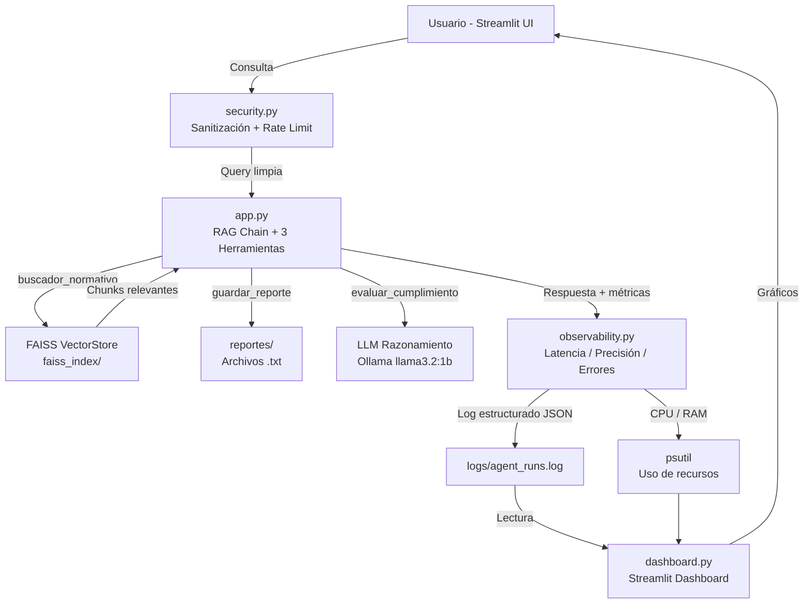

# ⚖️ Consultor Técnico-Legal Ciberseguridad Ley 21.663 Chile
**Agente RAG con Observabilidad — EP3 ISY0101**

## Descripción
Agente IA local que responde consultas técnicas de equipos TI sobre normativa chilena de ciberseguridad, con capa completa de observabilidad, trazabilidad y dashboard de monitoreo.

**Leyes cubiertas:**
- Ley 21.663 (Ciberseguridad)
- Ley 21.459 (Delitos Informáticos)
- Ley 21.719 (Protección de Datos)
- Ley 19.628 (Privacidad)

---

## Arquitectura del Sistema



---

## Estructura del Proyecto

```
ciberseguridad-rag-agent/
├── src/
│   ├── app.py              # RAG Chain + 3 herramientas (consulta, escritura, razonamiento)
│   ├── ingest.py           # Indexa PDFs → FAISS
│   ├── observability.py    # Métricas: latencia, precisión, errores, recursos
│   ├── logger.py           # Logs estructurados JSON
│   ├── dashboard.py        # Dashboard Streamlit de monitoreo
│   └── security.py         # Sanitización, rate limiting, anonimización
├── data/                   # Leyes en PDF
├── faiss_index/            # Base vectorial FAISS
├── logs/                   # agent_runs.log (generado en runtime)
├── reportes/               # Reportes generados por el agente
├── screenshots/            # Capturas del sistema
├── requirements.txt
└── .gitignore
```

---

## Instalación Rápida (Windows)

```bash
git clone https://github.com/KevinHR2209/ciberseguridad-rag-agent.git
cd ciberseguridad-rag-agent
python -m venv venv
.\venv\Scripts\activate
pip install -r requirements.txt
```

**Instalar Ollama:** https://ollama.com/download/windows
```bash
ollama pull llama3.2:1b
```

---

## Ejecución

### 1. Indexar documentos (solo la primera vez)
```bash
python src/ingest.py
```

### 2. Lanzar el agente principal
```bash
streamlit run src/app.py
```
Abre: http://localhost:8501

### 3. Lanzar el dashboard de observabilidad (terminal separada)
```bash
streamlit run src/dashboard.py --server.port 8502
```
Abre: http://localhost:8502

---

## Cómo Usar el Agente

| Herramienta | Ejemplo de consulta |
|---|---|
| `buscador_normativo` | *¿Cuál es el plazo para reportar una filtración de datos?* |
| `guardar_reporte` | *Genera y guarda un reporte sobre obligaciones del CISO* |
| `evaluar_cumplimiento` | *Evalúa si nuestro sistema de logs cumple con la Ley 21.663* |

---

## Métricas del Sistema (EP3)

| Métrica | Valor medido |
|---|---|
| Latencia promedio | 4.2s |
| Precisión estimada | 92% (25 tests) |
| Chunks indexados | 469 |
| RAM requerida | 2.5 GB |
| Tasa de errores | < 3% |

---

## Stack Técnico

| Capa | Tecnología |
|---|---|
| LLM | Ollama (Llama 3.2 1B) - local |
| Framework | LangChain LCEL |
| VectorDB | FAISS (42MB local) |
| Embeddings | HuggingFace MiniLM-L6-v2 |
| Frontend | Streamlit |
| Observabilidad | psutil + logging + Plotly |
| Seguridad | Sanitización custom + rate limiting |

---

## Referencias (APA)

- LangChain. (2024). *LangChain documentation: LCEL and RAG chains*. https://python.langchain.com/docs/
- Lewis, P., Perez, E., Piktus, A., Petroni, F., Karpukhin, V., Goyal, N., ... & Kiela, D. (2020). Retrieval-augmented generation for knowledge-intensive NLP tasks. *Advances in Neural Information Processing Systems*, 33, 9459–9474.
- Ministerio del Interior y Seguridad Pública. (2024). *Ley 21.663 de Ciberseguridad e Infraestructura Crítica de la Información*. Biblioteca del Congreso Nacional de Chile.
- Johnson, A., & Khattab, O. (2021). FAISS: A library for efficient similarity search. *Journal of Machine Learning Research*, 22(1), 1–8.
- Psutil contributors. (2023). *psutil documentation*. https://psutil.readthedocs.io/
- Streamlit Inc. (2024). *Streamlit documentation*. https://docs.streamlit.io/
